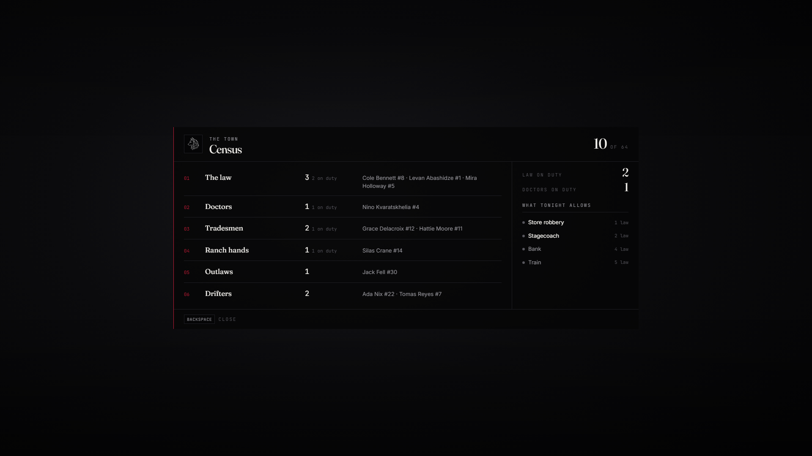

# lxr-census — Who is in town, for LXRCore

A page that counts the living by the core's job types, says how many of
the law and the doctors are on duty, and tells the outlaws what the town's
law count allows tonight. Names are a privacy setting; the counts are for
everyone. Other resources ask it before a robbery starts.



## What it does

* **Trades** — `Config.Census.trades` (core job types, in page order);
  each row shows the count, how many are on duty, and — for `names = 'all'`
  or staff under `'staff'` — the names, with server ids under `showIds`.
* **On duty** — law (leo + federal) and doctors.
* **Tonight** — `Config.Needs`: what the law count allows (store, coach,
  bank, train by default). `exports['lxr-census']:Allows(id)` returns
  `ok, lawNeeded` for any resource that gates on it.
* Open with `/census` or the key in `Config.Census.key` (F9).

## Install

```cfg
ensure lxr-core
ensure lxr-census
```

## API

| Name | Side | Purpose |
|---|---|---|
| `LawOnDuty()` | server | count of law on duty |
| `Allows(id)` | server | `ok, lawNeeded` for a need |
| `Count()` | server | people loaded |
| `IsOpen()` | client | page state |

## Licence

© 2026 iBoss21 / LXRCore — All Rights Reserved. See `LICENSE`.
